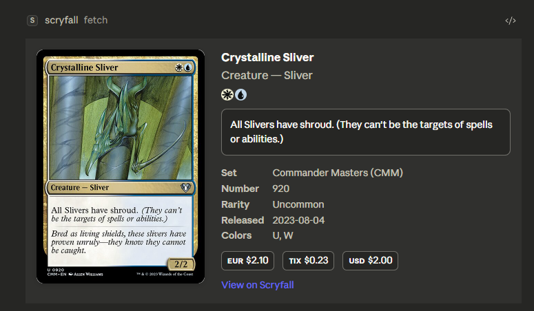

# Scryfall MCP Server

A community MCP server for searching and fetching Magic: The Gathering card data from [Scryfall](https://scryfall.com). Features an [MCP App](https://github.com/modelcontextprotocol/ext-apps) UI that renders card images, mana symbols, oracle text, and pricing when used in compatible hosts like Claude Desktop.

> **Note:** This is an independent community project. It is not affiliated with or endorsed by Scryfall.



## Tools

- **search** — Search for cards using [Scryfall full-text syntax](https://scryfall.com/docs/syntax) (e.g., `c:red t:creature cmc=3`, `set:mkm`, `o:"draw a card"`)
- **fetch** — Fetch full card details by Scryfall UUID. In MCP App-capable hosts, renders a card viewer UI with the card image, mana cost icons, oracle text, set info, rarity, and prices.

## Installation

### Option 1: MCPB (one-click install for Claude Desktop)

Download [`scryfall-mcp-server.mcpb`](https://github.com/olaservo/scryfall-mcp-app/releases/latest) from the latest release and open it in Claude Desktop.

### Option 2: npm

```json
{
  "mcpServers": {
    "scryfall": {
      "command": "npx",
      "args": ["-y", "@olaservo/scryfall-mcp-server"]
    }
  }
}
```

### Option 3: Build from source

```bash
git clone https://github.com/olaservo/scryfall-mcp-app.git
cd scryfall-mcp-app
npm install
npm run build
```

Then add to your `claude_desktop_config.json`:

```json
{
  "mcpServers": {
    "scryfall": {
      "command": "node",
      "args": ["/path/to/scryfall-mcp-app/dist/index.js"]
    }
  }
}
```

## Development

```bash
npm run dev          # Watch mode with tsx
npm run build        # Build UI + server
npm run inspector    # Test with MCP Inspector
npm run pack         # Build .mcpb bundle
```

## How It Works

The server uses the [MCP Apps extension](https://github.com/modelcontextprotocol/ext-apps) to pair the `fetch` tool with a card viewer UI resource. When a card is fetched:

- **`content`** returns a readable text summary (card text, metadata, prices) for the model
- **`structuredContent`** sends the full card data to the UI for rendering
- The UI renders the card image, Scryfall mana symbol SVGs in the mana cost and oracle text, and card metadata
- CSP is configured to allow images from `cards.scryfall.io` and SVGs from `svgs.scryfall.io`
- Non-UI hosts receive the text fallback with all card details
